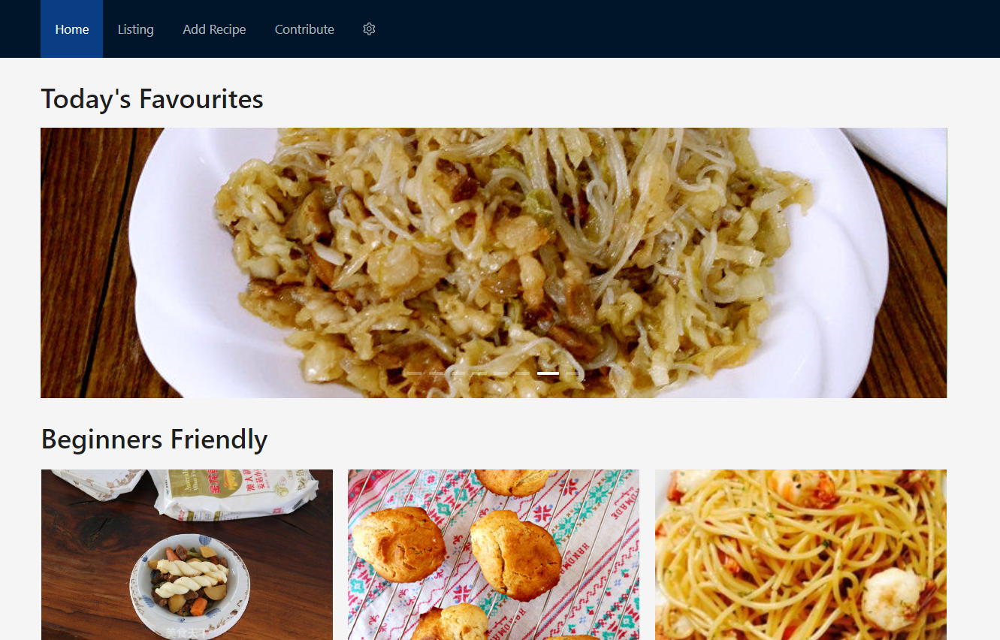
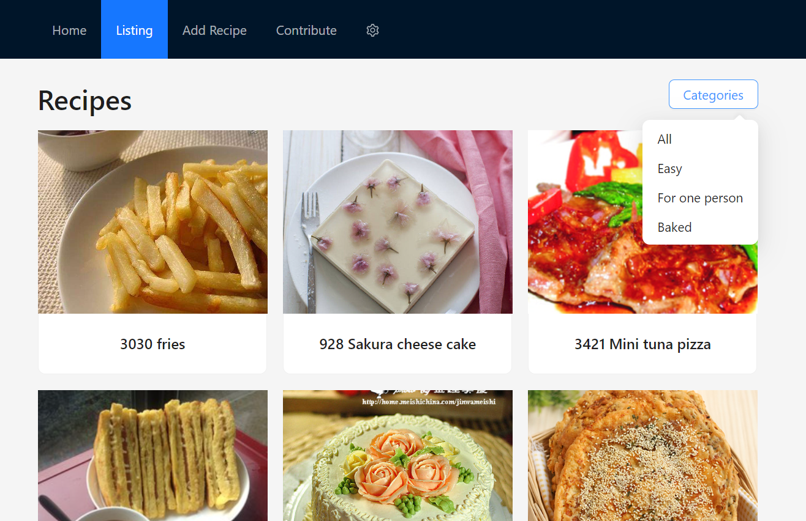
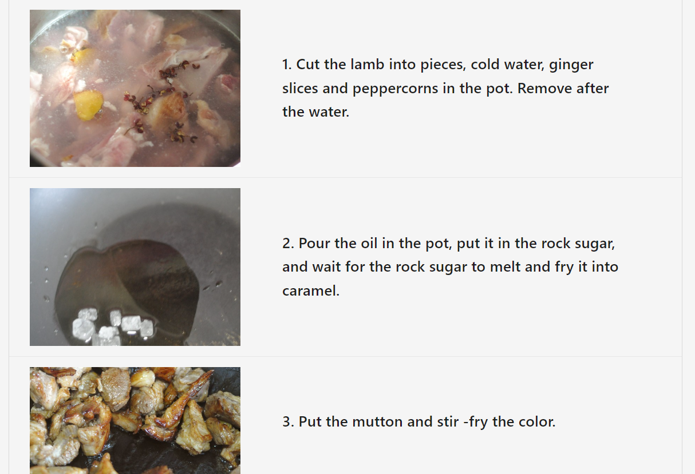

## Introduction

Welcome to Recipes, a project born from my love for Chinese cuisine and my desire to share the rich tapestry of flavors, traditions, and culinary secrets. To fill the lack of English translations online of "real" Chinese recipes, Recipe dedicates to present authentic traditional Chinese dishes and their interaction with different food cultures. The extensive collection of recipes are all meticulously crafted to bring the flavors of China to your kitchen. 

\

\

## Available Scripts

In the project directory, you can run:

### `npm start`

Runs the app in the development mode.\
Open [http://localhost:3000](http://localhost:3000) to view it in your browser.

The page will reload when you make changes.\
You may also see any lint errors in the console.

### `npm test`

Launches the test runner in the interactive watch mode.\
See the section about [running tests](https://facebook.github.io/create-react-app/docs/running-tests) for more information.

### `npm run build`

Builds the app for production to the `build` folder.\
It correctly bundles React in production mode and optimizes the build for the best performance.

The build is minified and the filenames include the hashes.\
Your app is ready to be deployed!

See the section about [deployment](https://facebook.github.io/create-react-app/docs/deployment) for more information.

## Learn More

